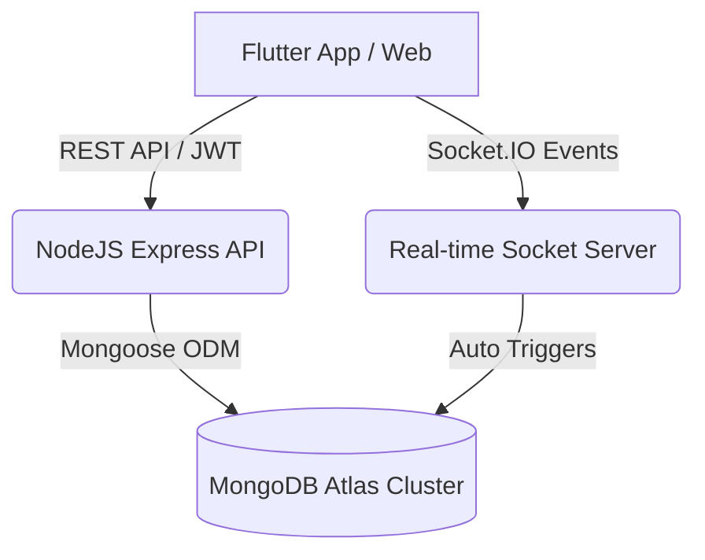

# 🚀 Enterprise Multi-Tenant HRMS Suite

A secure, high-performance, and feature-rich Human Resource Management System (HRMS) built using the **MERN (MongoDB, Express, Node.js)** backend stack and a **Flutter (Mobile & Web)** cross-platform frontend.

---

## 🏛️ Project Architecture



---

## 📱 Feature Overview by Role

### 1. Employee Self-Service (ESS)
*   **Geofenced Shift Clock-In**: Register attendance via GPS coordinates validation, stateful Biometric fingerprint scan, or badges QR code scanning.
*   **Time Ledger**: Monthly attendance log with regularizations requests.
*   **Leaves Portal**: Live casual/sick leave balances tracking and applications desk.
*   **Payslip & Finances**: View payroll slips and apply for salary advance loans.
*   **Claim Reimbursement**: Snap receipt photos, upload via multipart requests, and track status.
*   **Live Collaboration**: Real-time Socket.IO peer-to-peer and group chat rooms with image attachment uploads.
*   **Appraisals & Training**: Track personal KPIs, goals, and training checklists.

### 2. HR & Manager Console
*   **Approvals Panel**: Unified hub to approve/reject leaves, expenses, loans, and timecard corrections.
*   **Hiring Console**: Funnel metrics, job postings publisher, applicant pipelines, AI Match resume scoring, and employee onboarding checklists.
*   **Staff Monitor**: Live daily log tracking attendance logs across the entire workforce.

### 3. Corporate Workspace Admin
*   **Workspace Configurations**: Define shift rosters, holiday catalogs, and company localization settings.
*   **Platform Security**: Enforce network IP whitelisting limits.
*   **B2B Sign-up**: Self-register workspace tenants on the mobile signup panel (awaiting Super Admin approval).

### 4. Platform Super Admin (Console)
*   **B2B Directory**: Search, block, reset passwords, and audit company accounts.
*   **CEO Impersonation**: Safely log in as tenant admins to troubleshoot configurations.
*   **Settings Panels**: Maintenance mode, password policies, SMTP mailers, and global module toggles.
*   **Analytics & Exports**: Growth indicators, interactive charts, and exports to **CSV, Excel, or PDF**.

---

## 🚀 Backend Setup & Deployment

### 1. Local Configuration
1. Navigate to the backend folder:
   ```bash
   cd backend
   ```
2. Install npm dependencies:
   ```bash
   npm install
   ```
3. Create a `.env` file:
   ```env
   PORT=5000
   MONGO_URI=mongodb+srv://<user>:<password>@cluster0.mongodb.net/hrms
   JWT_SECRET=HRMS_SUPER_SECRET_KEY@_123
   ```
4. Start the development server:
   ```bash
   npm run dev
   ```

### 2. Deployment (Render)
*   **Type**: Web Service
*   **Root Directory**: `backend`
*   **Build Command**: `npm install`
*   **Start Command**: `node server.js`
*   **Environment Variables**: Bind `MONGO_URI` and `JWT_SECRET`.

---

## 📱 Flutter Frontend Setup & Build

### 1. Configuration
Open [lib/config/constants.dart](file:///c:/Users/Vikas/AndroidStudioProjects/HRMS%20mobile%20app/lib/config/constants.dart) and configure your server API address:
```dart
static const String apiBaseUrl = 'https://YOUR_BACKEND_URL.onrender.com/api';
```

### 2. Run Locally
```bash
flutter pub get
flutter run
```

### 3. Build Web App for Render
To host the Web frontend as a static site:
1. Compile the build:
   ```bash
   flutter build web --release
   ```
2. Navigate to `build/web`, initialize Git, and push to a deploy branch (e.g. `web-build`).
3. Deploy to Render as a **Static Site** referencing the compiled branch.

